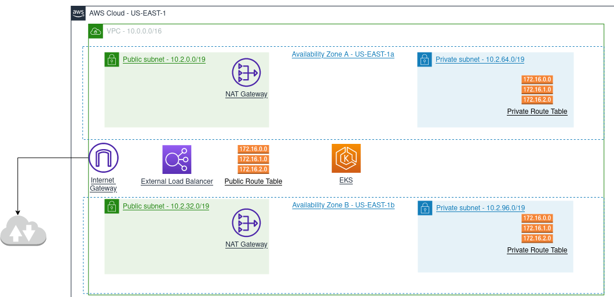

# Challenge 1

## Tareas

- [x] Forkea este repositorio y envía una solicitud PR "Pull Request" con la Solución:
- [x] Dockerfile Frontend y Backend
- [x] Subir la Imagen del Frontend y Backend al Registry Docker Hub. Puedes acceder a ellas haciendo click en [frontend](https://hub.docker.com/repository/docker/waltergsteven/frontend_pokemon) y [backend](https://hub.docker.com/repository/docker/waltergsteven/backend_pokemon)
- [x] Docker-compose
- [x] Documentación y Arquitectura
- [x] No te olvides de revisar que no tenga vulnerabilidades.
- [ ] Opcional Arquitectura en AWS
- [ ] Opcional Si cuentas con una cuenta en AWS despliega la solución.
- [ ] Opcional Pueden usar kubernetes

## Documentación

### Dockerfile
Los archivos Dockerfile se encuentran en la raíz de cada proyecto, en el caso del frontend se encuentra en la carpeta frontend-pokemon-app y en el caso del backend se encuentra en la carpeta backend-pokemon-app.
El archivo Docker-compose se encuentra en la raíz del proyecto.

### Variables de entorno
La variable de entorno utilizada es encriptada utilizando el archivo `env-encrypt.sh` dentro de la carpeta `frontend`<br>

Para desencriptarla se utiliza el archivo `env-decrypt.sh` dentro de la carpeta `frontend`

> **Nota:** Para poder ejecutar los archivos `env-encrypt.sh` y `env-decrypt.sh` se debe tener instalado el paquete `openssl` en el sistema operativo y tener acceso al archivo `.env.pass`.

Finalmente, se ha creado un Github Action para que cada vez que se haga un push a la rama `master` se ejecute el archivo `env-decrypt.sh` y se suba el archivo `.env` al repositorio. Este se utiliza para crear la imagen del frontend y backend en Docker Hub.

### Arquitectura en AWS construida con Terraform

Esta es una arquitectura con dos zonas de disponibilidad y tres ambientes: dev, prod y stg. Con los que se puede desplegar la aplicación de forma escalable y segura en EKS.



Para desplegar la arquitectura se debe tener instalado Terraform y AWS CLI. Se debe configurar un perfil de AWS con las credenciales de acceso a la cuenta de AWS. 

Para desplegar la arquitectura se debe ejecutar el siguiente comando:

```bash
cd terraform
terraform init
terraform workspace new prod
terraform apply
```

### Kubernetes

