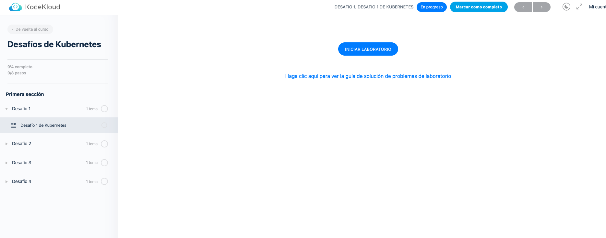
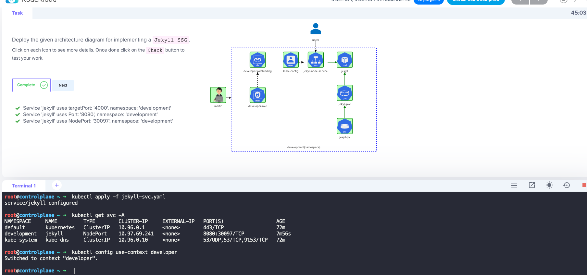
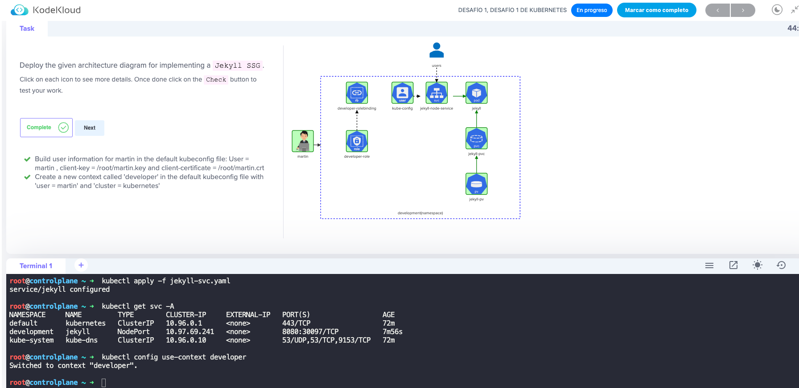
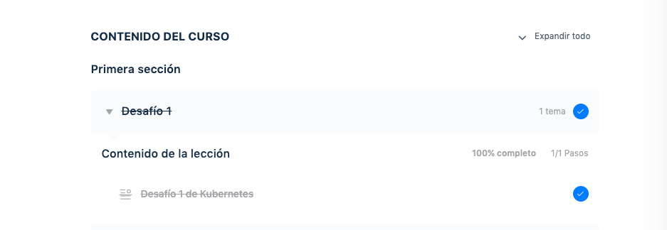

### Kubernetes Challenges

Los desafíos de Kubernetes son un conjunto de desafíos GRATUITO, divertido y desafiante para practicar Kubernetes de forma práctica.

Estos desafíos están especialmente diseñados para brindarle más experiencia práctica y desafíos que lo ayudarán a sobresalir en Kubernetes.

Kubernetes Challenges hace que aprender y practicar sus habilidades de Kubernetes sea divertido al proporcionarle un conjunto de desafíos. Por ejemplo, implementar nuevas aplicaciones en un clúster, solucionar problemas de aplicaciones existentes, solucionar y solucionar problemas relacionados con la seguridad y la red dentro del clúster y muchos más.

El portal del desafío se abre directamente en su navegador. Se le proporciona un diagrama de arquitectura de la aplicación que se implementará y un temporizador de cuenta regresiva antes del cual debe completar todas las tareas.

¡GRATIS!

KodeKloud (KodeKloud)[https://kodekloud.com/courses/kubernetes-challenges/]

## ¿Lo que debe hacerse?

- Enviar Captura del Desafío 1
- Solución

- Si te animas puedes terminar el resto de los Desafios estan geniales

